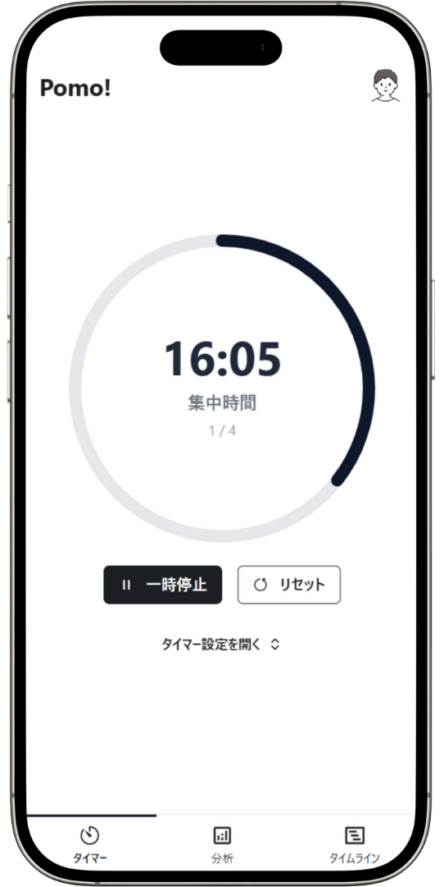
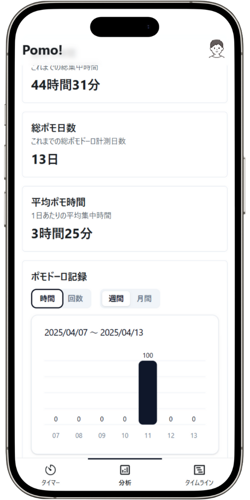
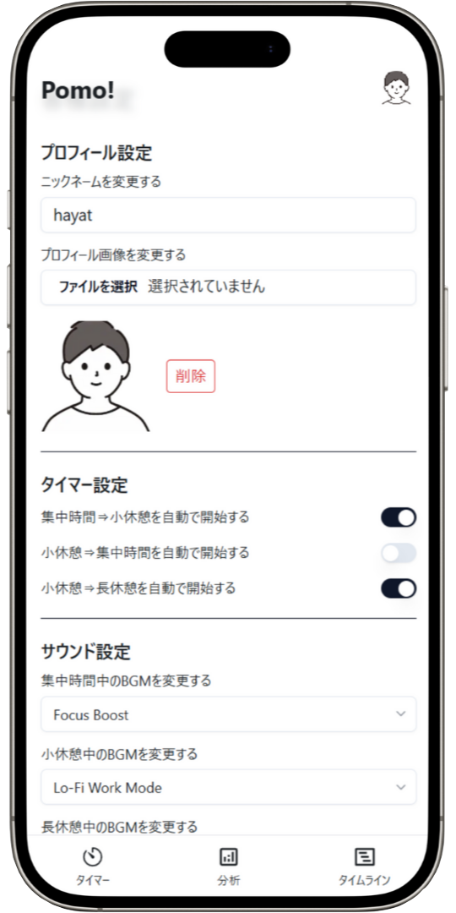
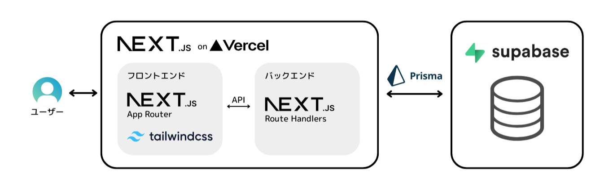
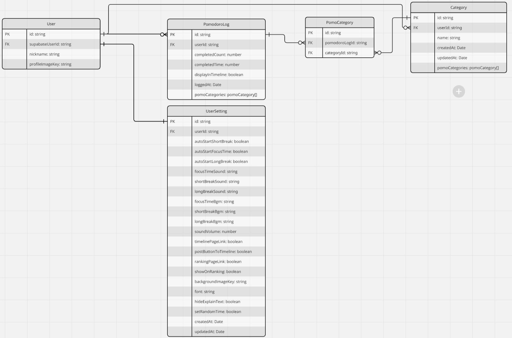

# Pomo!

## はじめに

このアプリは、ほぼ全ての機能を **オン/オフ切り替え可能** な、 **カスタマイズ性抜群** のポモドーロ記録アプリです。

## ポモドーロテクニックとは

ポモドーロテクニックは時間管理法の一つで、作業を25分間（1ポモドーロ）集中して行い、その後5分間の休憩を取るというサイクルを繰り返す方法です。4ポモドーロごとに、より長い休憩（15〜30分）を取ります。この手法は、集中力の維持や作業効率の向上、疲労軽減に効果があるとされています。

## 概要

https://pomo-custom.vercel.app/

このアプリは、ポモドーロテクニックを使って **学習･作業時間を記録したい** と考えている人向けに、  
既存のアプリではユーザーにとって必要/不要な機能が入り混じっているという課題を、  
ほぼすべての機能を **オン/オフ切り替え可能** という機能で解決する、高いカスタマイズ性を持ったポモドーロ記録アプリです。

|  |  |  |
| :--------------------------------: | :-------------------------------: | :------------------------------: |
|         **タイマーページ**         |          **分析ページ**           |          **設定ページ**          |

## 主要機能

- **カスタマイズ可能なポモドーロタイマー**: 作業時間・休憩時間を自由に設定
- **カテゴリー機能**: カテゴリー登録＆カテゴリーごとの分析が可能
- **機能のオン/オフ切り替え**: 必要な機能だけを有効化
- **統計とデータ可視化**: 学習・作業時間の分析と可視化
- **サウンド設定**: カスタマイズ可能な音声通知
- **ユーザー認証**: Supabase Authによる安全なログイン

## システム構成図



## 使用技術

### フロントエンド

- **言語**: TypeScript
- **フレームワーク**: [Next.js 14](https://nextjs.org/) (App Router)
- **スタイリング**: [TailwindCSS](https://tailwindcss.com/), [Radix UI](https://www.radix-ui.com/), [shadcn/ui](https://ui.shadcn.com/)
- **状態管理/データフェッチ**:
  - [SWR](https://swr.vercel.app/ja): データフェッチと状態管理

### バックエンド

- **言語**: TypeScript
- **フレームワーク**: [Next.js 14](https://nextjs.org/) (Route Handlers)
- **データベース**: PostgreSQL ([Supabase Database](https://supabase.com/docs/guides/database/overview))
- **ORM**: [Prisma](https://www.prisma.io/)
- **認証**: [Supabase Auth](https://supabase.com/docs/guides/auth)
- **ストレージ**: [Supabase Storage](https://supabase.com/docs/guides/storage)

### 開発環境・インフラ

- **IDE**: Cursor
- **ホスティング**: Vercel
- **バージョン管理**: Git, GitHub
- **デザイン**: Figma

### 主要なライブラリ

- [React Hook Form](https://react-hook-form.com/): フォーム管理
- [Zod](https://zod.dev/): バリデーション
- [React Select](https://react-select.com/home): セレクトボックス
- [ESLint](https://eslint.org/) / [Prettier](https://prettier.io/): コード品質管理
- [Tone.js](https://tonejs.github.io/): 音声再生
- [Recharts](https://recharts.org/): データ可視化
- [React Toastify](https://fkhadra.github.io/react-toastify/): 通知
- [Jest](https://jestjs.io/ja/) / [Testing Library](https://testing-library.com/): テスト

## データベース設計



## 開発環境のセットアップ

### 前提条件

- Node.js 18.x以上
- npm
- Git

### インストール手順

1. リポジトリをクローン:

```bash
git clone https://github.com/hayato33/pomo.git
cd pomo
```

2. 依存関係をインストール:

```bash
npm install
```

3. 環境変数を設定:
   `.env`ファイルを作成し、変数を設定（具体的な値は管理者にお問い合わせください）

4. 開発サーバーを起動:

```bash
npm run dev
```

5. ブラウザで http://localhost:3000 を開いてアプリにアクセス
